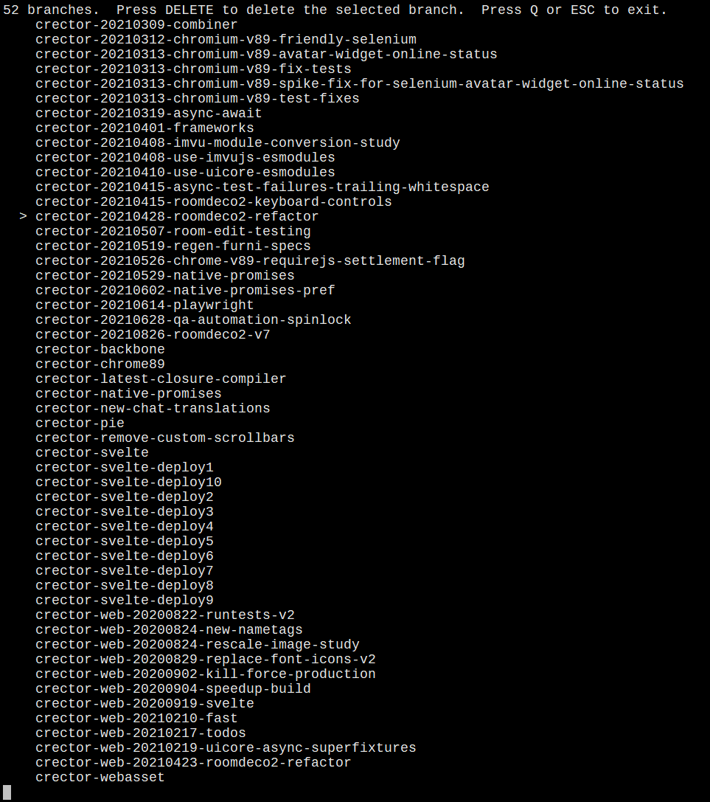

# Nuke Branches

At work I accumulate git branches rapidly.  Every so often I prune a bunch of them.  I can tediously `git branch -D XXX` but I wanted something faster, especially because my branch names tend to be long and timestamped.  This tool can delete many branches quickly by scrolling through a list and tapping the delete key.

**Note that I've currently only tested this on Ubuntu 18, since that is what I use for my work VM.**



# Building

Make sure you have `gcc` installed and then run:

```sh
./build.sh
```

# Usage

Add the binary to your `PATH`.  Navigate into a git repository and run:

```sh
nuke_branches
```
